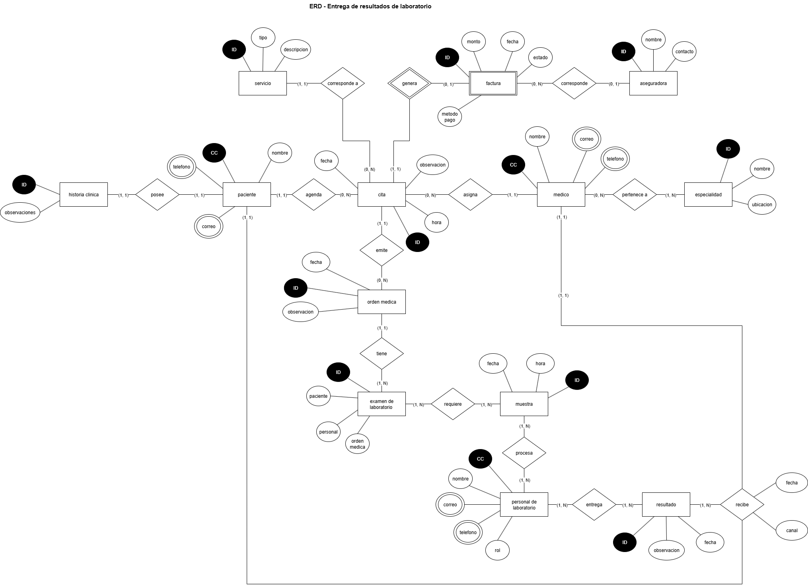
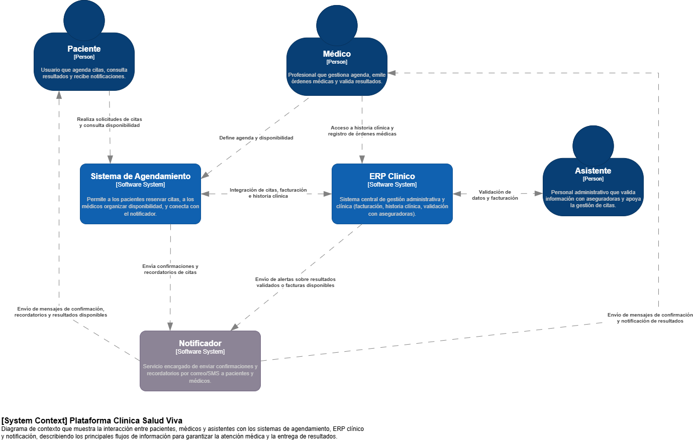

# 🗒️ Registro de Trabajo en Clase - Taller 2

## 📆 Fecha de la sesión
_16/08/2025_

## 👥 Integrantes presentes
- Juan David Cetina Gómez
- Ana Lucía Quintero Vargas
- Mariana Salas Gutiérrez

## 🧠 Actividades realizadas en clase

Durante la sesión se trabajó en la modelación del dominio de la Clínica Salud Viva, enfocándonos en dos entregables principales:

1. **Un modelo entidad–relación (ERD)** que organiza las entidades principales del sistema (paciente, cita, médico, especialidad y factura, entre otras) y sus relaciones.

2. **Un diagrama de contexto de negocio** que representa la interacción entre actores (paciente, médico, asistente) y sistemas (ERP clínico, sistema de agendamiento, notificador).

En este caso, se discutieron los flujos de información, cómo viajan los datos entre actores y sistemas, y se tomaron decisiones para evitar redundancias, en especial sobre el rol del notificador como canal de salida.

- **¿Qué se discutió con el equipo?**
    Se analizó el caso de referencia de la Clínica Salud Viva, identificando qué actores y entidades eran imprescindibles en el modelo (paciente, cita, médico, especialidad, factura). También se revisó cómo representar el flujo de información en el diagrama de contexto, en especial la relación entre notificador, sistemas internos y los actores externos.

- **¿Qué decisiones de modelado se tomaron?**
    Se evaluarón que elementos del caso base debían ser tomados como entidades fuertes y débiles, junto con sus atributos esenciales y relaciones para ser modelados adecuadamente, también bajo el contexto específico de entrega de resultados de laboratorio. Adicional para el caso del diagrama de contexto, se tuvo que evaluar que sistemas y actores podrían considerarse internos o externos del proceso, indicando entre ellos las distintas acciones que podrían realizar. 

- **¿Qué herramientas se usaron (papel, pizarra, draw.io, Astah)?**
    Se usó principalmente draw.io para facilitar la construcción colaborativa de los diagramas, discutiendose inicialmente en forma conceptual antes de digitalizar.

- **¿Qué parte del trabajo se alcanzó a desarrollar?**
    Se alcanzó a adelantar el ERD simple, incorporando las entidades y relaciones principales del caso. Además, se alcanzó a discutir los actores, sistemas y flujos de datos que iban a ser representados en el diagrama de contexto de negocio. 

## 🧩 Boceto inicial del modelo

El anterior diagrama representa las entidades principales del dominio de la clínica (Paciente, Cita, Médico, Especialidad, Factura, Aseguradora, Servicio, Examen de laboratorio, Muestra, Resultado, Historia clínica, Orden médica y Personal de laboratorio) y cómo se relacionan entre sí. Se establecieron cardinalidades y se nombraron relaciones de forma clara para reflejar la lógica del negocio clínico y administrativo.

En este modelo se muestra la interacción entre los actores principales (Paciente, Médico, Asistente) y los sistemas (Sistema de Agendamiento, ERP Clínico y Notificador externo). Se definió que el Sistema de Agendamiento es el núcleo de interacción, mientras que el ERP Clínico gestiona lo administrativo y clínico, y el Notificador entrega la comunicación final a Paciente y Médico. Asimismo, se trazaron los flujos de información principales (solicitudes, confirmaciones, validaciones, resultados y notificaciones).

## 🔁 Tareas definidas para complementar el taller

Anote las responsabilidades acordadas entre los miembros del equipo para completar la entrega final:

| Tarea asignada | Responsable | Fecha estimada |
|----------------|-------------|----------------|
| Modelado final en draw.io | Mariana Salas Gutiérrez y Ana Lucía Quintero Vargas | 16/08 |
| Redacción del informe     | Mariana Salas Gutiérrez y Ana Lucía Quintero Vargas | 19/08 |
| Investigación y referencias | Juan David Cetina Gómez | 21/08 |

---

_Este documento resume el trabajo colaborativo realizado durante la sesión del taller 2 en el curso AREM - Universidad de La Sabana._
