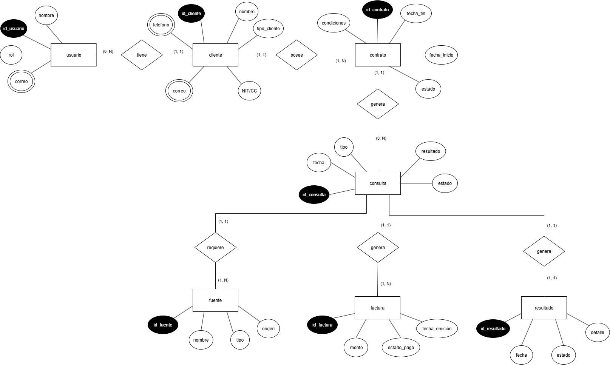
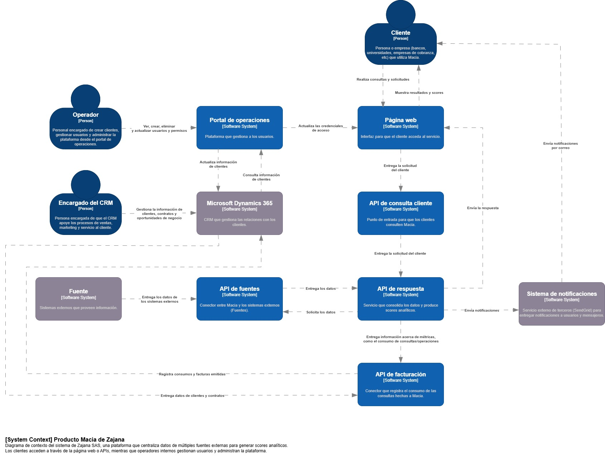

# 📄 Informe Técnico del Taller

## 🔖 Nombre del Taller
_Taller 2 - Modelo de Información y Diagrama de Contexto_

## 👥 Integrantes del equipo
- Juan David Cetina Gómez (juancego@unisabana.edu.co)
- Ana Lucía Quintero Vargas (anaquiva@unisabana.edu.co)
- Mariana Salas Gutiérrez (marianasalgu@unisabana.edu.co)

## 🧠 Descripción general del trabajo
El taller tuvo como propósito modelar las entidades principales y los flujos de información entre actores y sistemas, siguiendo la lógica del modelo C4 en su nivel de contexto (C1) y complementándolo con un modelo entidad-relación (ERD).
Inicialmente se trabajó en clase con el caso base de la Clínica Salud Viva, lo que permitió practicar la identificación de actores, sistemas internos y externos, así como las relaciones clave de negocio. Posteriormente, el aprendizaje se aplicó al caso real de la empresa Zajana S.A.S., donde se desarrollaron el ERD y el diagrama de contexto que reflejan de manera específica su arquitectura de información.

## 🔧 Proceso de desarrollo
El trabajo se llevó a cabo de manera colaborativa utilizando draw.io, que permitió a los integrantes del equipo construir y ajustar los diagramas en tiempo real ya sea en clase o por fuera de la sesión, utilizando diferentes figuras que integra para cada tipo de diagrama.

La primera decisión tomada fue realizar el modelo entidad-relación (ERD) como representación inicial del caso empresarial, lo cual permitió detallar las entidades de información del dominio (clientes, usuarios, contratos, operaciones, facturación, etc.) y sus relaciones.
Posteriormente, se volvió a retomar los actores y sistemas principales que se ven involucrados para dar forma al diagrama de contexto de negocio.

El desarrollo se organizó en dos fases:

1. En clase, se practicó con la Clínica Salud Viva para asegurar un entendimiento común.

2. De manera independiente, se aplicó el ejercicio al caso de Zajana, ajustando el modelo a su contexto real.

## 🧩 Análisis del modelo propuesto
- **Cómo se estructura el modelo entregado**
    - **ERD:**
        Incluye algunas entidades clave de Zajana (Cliente, Usuario, Contrato, Factura, Consulta, Fuente de datos, entre otras) y sus relaciones. Este diagrama permite visualizar cómo se conecta la gestión operativa y administrativa dentro de la empresa.

    - **Diagrama de contexto:**
        - **Actores:** Cliente, Operador, Encargado del CRM.
        - **Sistemas internos:** Portal de operaciones, página web y APIs (consulta clientes, facturación de consulta cliente y de respuesta).
        - **Sistemas externos:** Microsoft Dynamics 365 (CRM), fuentes de datos y sistema de notificaciones.
        - **Relaciones clave:**
            - Cliente -> Consulta y recibe Scores.
            - Operador -> Administra usuarios y permisos.
            - CRM -> Centraliza información comercial.
            - Fuentes -> Entregan datos externos a Zajana.
            - Notificaciones -> Comunican eventos al cliente.

- **Cómo representa las necesidades del cliente**
Ambos modelos realizados representan la necesidad de alinear procesos comerciales, técnicos y administrativos dentro de Zajana para mejorar la eficiencia y la trazabilidad de sus servicios.

Por un lado, el diagrama de Entidad-Relación refleja cómo se gestionan las entidades las entidades fundamentales de Zajana, como lo son los clientes, usuarios, contratos, operaciones y facturación, mostrando la necesidad de centraliar la información para evitar duplicidades.

Por otro lado, el diagrama de contexto evidencia cómo los actores (clientes, operadores y ecargados del CRM) interactúan con sistemas internos (portal, APIs y web) y externos (CRM, fuentes y notificaciones), lo que permite visualizar los puntos de integración necesarios para soportar la operación.

- **Qué supuestos se tomaron**
    - Se asume que el sistema de Zajana cuenta con integración estable con sistemas externos (CRM, fuentes de datos y servicio de notificaciones).
    - Se asume que los actores identificados (clientes, operadores y encargados de CRM) representan los principales roles en la operación.
    - Se asume que la información crítica de clientes, contratos y facturación se gestiona bajo normativas de protección de datos aplicables. En este caso, con el cumplimiento de ISO 2700 y Habeas Data.
    - Se asume que las entidades y relaciones definidas en el ERD cubren parte relevante de los procesos clave de la empresa, pudiendo ampliarse con detalles operativos en fases posteriores.

## 📈 Diagrama final entregado

## 📋 Tabla de actores, entidades o componentes (si aplica)
La tabla para ERD aplicado a Zajana SAS es la siguiente:

| Nombre del elemento | Tipo | Descripción | Responsable |
|---------------------|------|-------------|-------------|
| Cliente        | Entidad | Persona o empresa que solicita servicios y genera operaciones dentro de Zajana. | Cliente |
| Usuario        | Entidad | Persona asociada a un cliente, con credenciales para acceder al sistema. | Cliente |
| Contrato        | Entidad | Define el acuerdo formal entre Zajana y el cliente. | Zajana |
| Factura        | Entidad | Documento financiero asociado a las consultas realizadas. | Zajana |
| Consulta        | Entidad | Registro de las solicitudes hechas por el cliente (ej. score, validación, verificación). | Cliente/Zajana |
| Fuente de datos        | Entidad | Sistemas externos que proveen información para las consultas (registros y bases de datos). | Externo |
| Resultado        | Entidad | Resultado de la consulta (score, reporte, verificación). | Zajana |

La tabla para C1 aplicado a Zajana SAS es la siguiente:

| Nombre del elemento | Tipo | Descripción | Responsable |
|---------------------|------|-------------|-------------|
| Cliente        | Actor (Person) | Persona o empresa (ej. bancos, entidades de crédito) que consulta información y solicita scores. | Cliente |
| Operador        | Actor (Person) | Personal interno encargado de crear clientes, gestionar usuarios y administrar la plataforma. | Zajana |
| Encargado del CRM        | Actor (Person) | Persona encargada de que el CRM apoye los procesos de ventas, marketing y servicio al cliente. | Zajana |
| Fuente        | Componente (External Software System) | Sistemas externos que proveen información utilizada por Zajana (ej. registros, bases de datos). | Externo |
| Página web        | Componente (Software System) | Interfaz que permite al cliente acceder al servicio, realizar consultas y recibir respuestas. | Zajana |
| Portal de operaciones        | Componente (Software System) | Plataforma interna que usan los operadores para crear y administrar clientes y usuarios. | Zajana |
| API de consulta cliente        | Componente (Software System) | Punto de entrada para solicitudes de clientes hacia Zajana (consultas de scores, datos). | Zajana |
| API de fuentes        | Componente (Software System) | Conector entre Zajana y los sistemas externos (Fuentes) para obtener datos necesarios. | Zajana |
| API de facturación        | Componente (Software System) | Registra el consumo de consultas y operaciones hechas en Zajana, base para facturación a clientes. | Zajana |
| Sistema de notificaciones        | Componente (External Software System) | Servicio que envía notificaciones por correo a clientes, informando sobre la disponibilidad de scores, cambios en el estado de consultas o similares. | Externo |
| CRM (Microsoft Dynamics 365)        | Componente (External Software System) | Sistema de gestión de relaciones con clientes que centraliza información comercial, contratos y oportunidades de negocio. | Externo |

## 🔍 Investigación complementaria
### Tema investigado:
(Ej: Buenas prácticas BPMN, comparación TOGAF vs C4, principios de seguridad STRIDE, etc.)

### Resumen:
Describa en 2–3 párrafos lo investigado, citando fuentes cuando sea necesario. Incluya cómo se relaciona con el taller.

## 📚 Referencias
- [1] Apellido, Nombre. *Título*. Año. URL o DOI.
- [2] Fuente oficial BPMN: https://www.omg.org/spec/BPMN/

---

_Este documento hace parte de la entrega del taller 2 del curso AREM (Arquitectura Empresarial) - Universidad de La Sabana._
